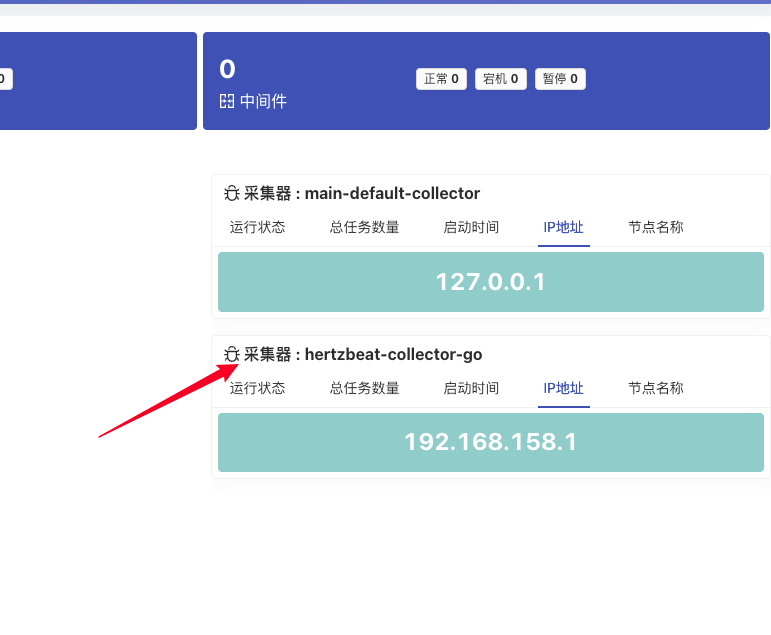

# HCG 调试

## 启动 Hertzbeat Manager

```shell
wget https://github.com/apache/hertzbeat/releases/download/v1.7.3/apache-hertzbeat-1.7.3-docker-compose.tar.gz

tar -zxvf apache-hertzbeat-1.7.3-docker-compose.tar.gz

cd hertzbeat-postgresql-victoria-metrics

docker compose up -d
```

## 启动 Java Collector（如有需要）

```shell
docker run -d \
    -e IDENTITY=custom-collector-name \
    -e MODE=public \
    -e MANAGER_HOST=127.0.0.1 \
    -e MANAGER_PORT=1158 \
    --name hertzbeat-collector apache/hertzbeat-collector
```

-e IDENTITY=custom-collector-name : (可选) 设置采集器的唯一标识名称。注意多采集器时名称需保证唯一性。
-e MODE=public : 配置运行模式(public or private), 公共集群模式或私有云边模式。
-e MANAGER_HOST=127.0.0.1 : 重要, 配置连接的 HertzBeat Server 地址，127.0.0.1 需替换为 HertzBeat Server 对外 IP 地址。
-e MANAGER_PORT=1158 : (可选) 配置连接的 HertzBeat Server 端口，默认 1158.

## 启动 Go Collector

启动前检查 etc 目录下的配置文件 `etc/hertzbeat-collector-go.yml` 中的 Manager 地址是否正确。

### 二进制启动

`make dev-run`

### 容器启动

```shell
make image-build

docker run -d \
  -v $(pwd)/etc/hertzbeat-collector.yaml:/var/hertzbeat/config/hertzbeat-collector.yaml\
  --name hertzbeat-go-collector \
  apache/hertzbeat-collector-go:4a6917188e31d153bddda6c03f2f2dd4057ef704
```

查看 go collector 是否注册到了 hertzbeat Manager：


